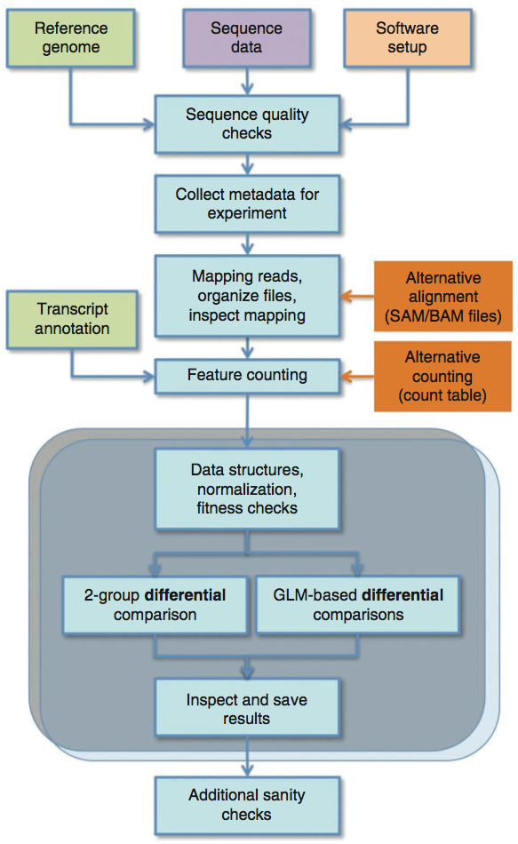
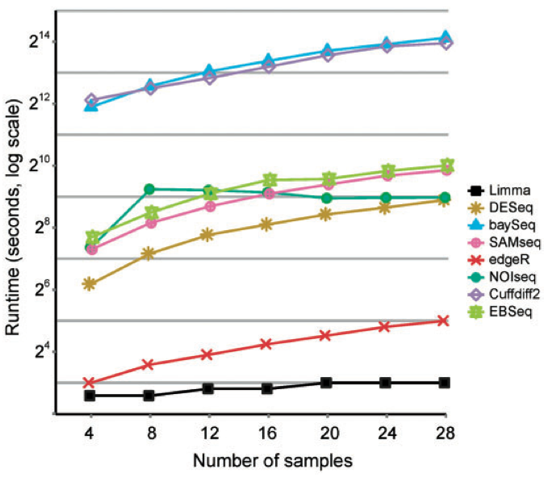
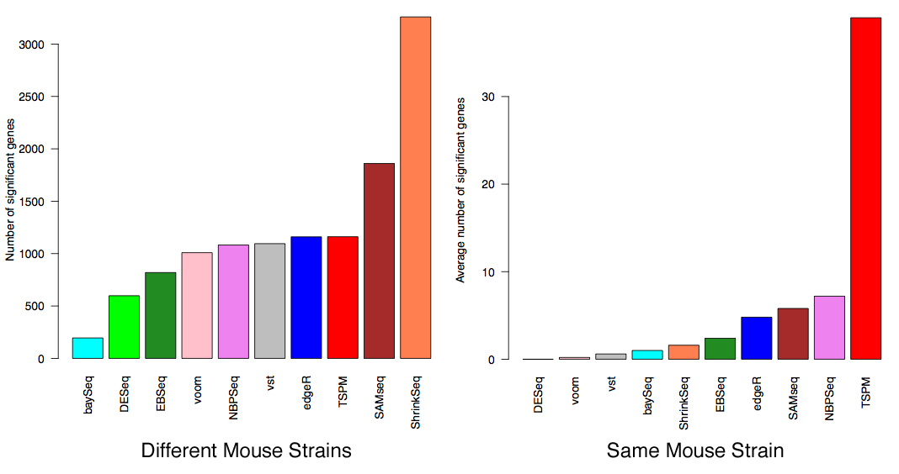
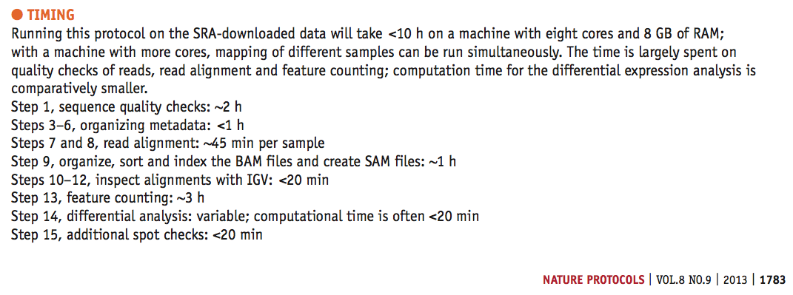
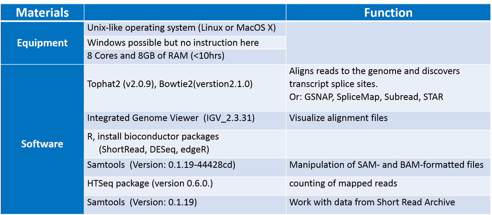
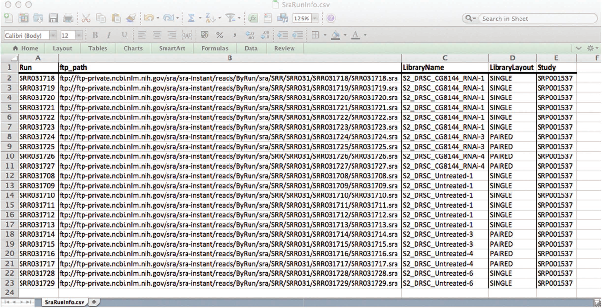
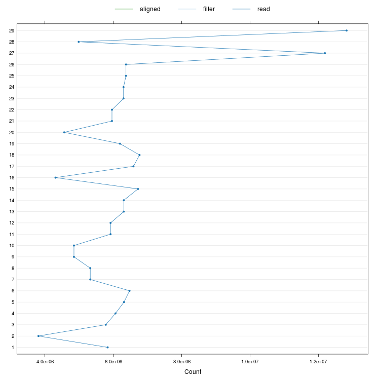
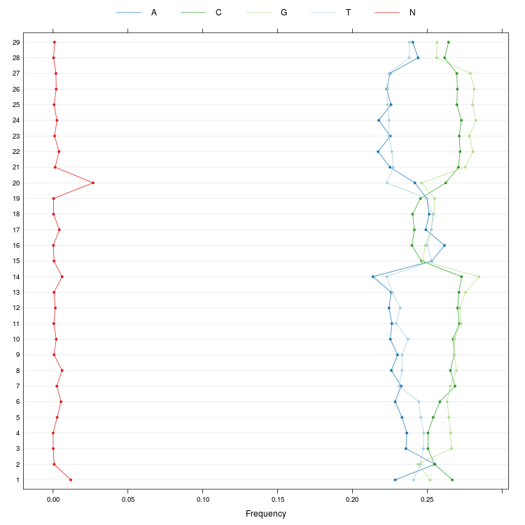
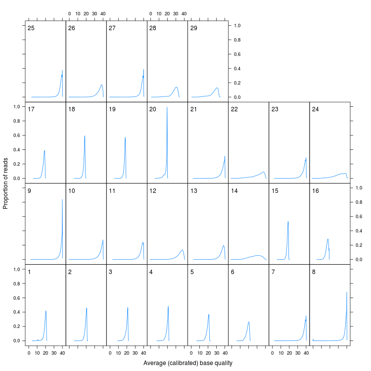
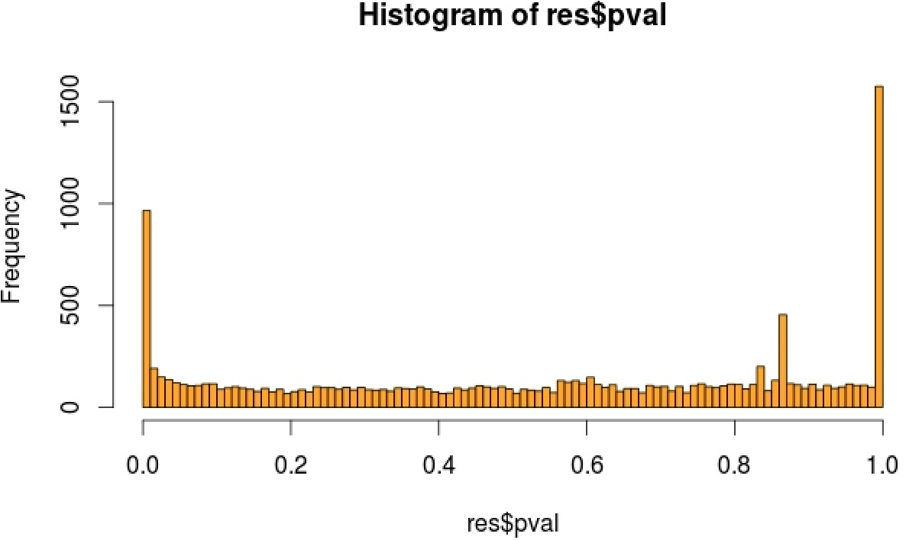

========================================================
autosize: true

Anna Engstrom, Yenfei Li, David Scoville, and Ravi Sood

March 13, 2014

BIOST 578A Final Project

Our motivation
========================================================

***

1. Become familiar with entire RNA-Seq workflow


2. Learn new software for differential-expression analysis

EdgeR and DESeq: popular and practical
========================================================
<br>


Seyednasrollah et al. *Brief Bioinform*. 2013.


Differential expression: statistical framework
========================================================
<br>
Intuitive approach to modeling # counts *Y* within gene *g* in sample *i*: 
$$Y_{gi}=\mathrm{Poisson}(\mu_{gi})$$
where <br>
$$\mu_{gi}=p_{gj}d_{i}$$
with <br>
-*p*: relative abundance of gene *g* in experimental group *j*<br>
-*d*: sequencing depth for sample *i*

Problem: **overdispersion**!

Improved model: $$Y_{gi}=\mathrm{NB}(\mu_{gi}, \sigma^2)$$
where <br>
$$\sigma^2=\mu_{gi} + \phi\mu^2_{gi}$$
with constant dispersion parameter $\phi$.


How do EdgeR and DESeq differ?
========================================================
   | EdgeR | DESeq |
---|-------|-------|
Model|$$Y_{gi}=\mathrm{NB}(\mu_{gi}, \sigma^2)$$ where $$\mu_{gi}=p_{gj}d_{i}$$|$$Y_{gi}=\mathrm{NB}(\mu_{gi}, \sigma^2)$$ where $$\mu_{gi}=p_{gj}d_{i}$$|
Mean-variance<br> relationship|$$\sigma^2=\mu_{gi} + \phi_{g}\mu^2_{gi}$$|$$\sigma^2=\mu_{gi} + \nu_{gj}d^2_{j}$$ with $$\nu_{gj}=f(p_{gj})$$|
Dispersion-<br>parameter estimation|Shrinks gene-wise estimates <br> toward common one|Higher of gene-wise estimate<br> and dispersion-mean trend |
Consequence|Sensitivity to outliers|Lower power|


EdgeR vs. DESeq: performance comparison
========================================================
<br>

Soneson and Delorenzi. *BMC Bioinformatics*. 2013.


Project overview
========================================================
<br>
Start: raw sequence data<br>
Finish: differential-expression analysis



Projected CPU time <10h? No problem...

Part I 
=========================================
- Software Setup 
- Sample sequence data, format conversion
- Reference genome 


Part I---software setup
===============================


Brian from DEOHS IT help us set up a server called "plasmid," running Ubuntu Linux system, with 250GB disk space and 96GB RAM. 
  

Getting started in R
=======================

```r
source("http://bioconductor.org/biocLite.R")
# Install all core packages and update all installed packages
biocLite("Biocupgrade")
biocLite(c("ShortRead","DESeq","edgeR"))
```


Sample Data
=============================
- Source: Brooks, et al. (2011); data deposited in Short Read Archive (SRA) under NCBI GEO (GSE18508)

- To automate the download from the SRA repository, obtained table of metadata called "SraRunInfo.csv"
 
- What we did here: read this CSV file into R and selected the subset of samples of interest using grep function. Downloaded 22 SRA files (~8GB)


```r
sri = read.csv("SraRunInfo.csv", stringsAsFactors=FALSE)
keep = grep("CG8144|Untreated-",sri$LibraryName)
sri = sri[keep,]
```


- Only required if data originate from the Short Read Archive (SRA)

SRA Table
===============================
There are 7 RNA-seq samples, each from cell culture of Drosophila melanogaster S2 cells. Three samples were treated with siRNA targeting the splicing factor pasilla(CG1844)('knockdown') and four samples are untreated('control')



Knockdown: S2_DRSC_CG8144_RNAi-1,3,4(n=3)  
Control: S2_DRSC_Untreated-1,3,4,6 (n=4)


Sequence Data converting from SRA to FASTQ format
=============================
Normally, sequencing data from a sequencing facility will come in compressed FASTQ format. The SRA uses its own format, SRA format. Thus we need to use the fastq-dump command from SRA Toolkit on each SRA file.


```r
# I ran this commands in Linux terminal:  
 $ cd  /Bigdata/DEARNA/sratoolkit/sratoolkit/bin
 $ fastq-dump --split-3 SRR031708. sra

# NOtice: --split-3 option splits mate-pair reads to separate files

```


Example: 
Paired-end data will produce _1.FASTQ and _2.FASTQ,  Single data will only give .FASTQ. 

Processing time: 1.5hr per file, 22 files, totally 33 hours, finally around 35GB!


Reference Genome Sequence
================================
- Drosophila reference genome from Ensemble

```r
# Run in terminal:
$ wget ftp://ftp.ensembl.org/pub/release-70/fasta/drosophila_melanogaster/\
$ dna/Drosophila_melanogaster.BDGP5.70.dna.toplevel.fa.gz
$ gunzip Drosophila_melanogaster.BDGP5.70.dna.toplevel.fa.gz

```

- Gene model annotation 

```r
# Run in terminal:
$ wget ftp://ftp.ensembl.org/pub/release-70/gtf/drosophila_melanogaster/\
$ Drosophila_melanogaster.BDGP5.70.gtf.gz
$ gunzip Drosophila_melanogaster.BDGP5.70.gtf.gz

```


Build the reference index (using bowtie2)
==========================================
Before reads can be aligned, the reference FASTA files need to be processed into an index that allows the aligner easy access.


```r
# Run in terminal: 
$ bowtie2-build -f Drosophila_melanogaster.BDGP5.70.dna.toplevel.fa Dme1_BDGP5_70
```

The new produced BT-2 file named: Dme1_BDGP5_70    


Beginning of Analysis
========================================================
Step 1: Assess sequence quality control using ShortRead


```r
library("ShortRead")

setwd("/BigData/DEARNA")
fqQC = qa(dirPath=".", pattern=".fastq$", type="fastq")
report(fqQC, type="html", dest="fastqQAreport")
```


fastQAreport
========================================================


```
Key

SRR031708.fastq 1
SRR031709.fastq 2
SRR031710.fastq  3
SRR031711.fastq	4
SRR031712.fastq	5
SRR031713.fastq	6
SRR031714_1.fastq	7
SRR031714_2.fastq	8
etc...
```

```
Number of reads per file

1 5836296
2 3812809
3 5781029
4 6064911
5 6313025
6 6475981
7 5327425
8 5327425
```


========================================================



========================================================


========================================================



========================================================
Collapse the SRA table from previous slide table to one row per sample and name it samples

```r
sri$LibraryName = gsub("S2_DRSC_","",sri$LibraryName) # trim label
samples = unique(sri[,c("LibraryName","LibraryLayout")])

 for(i in seq_len(nrow(samples))) {

  rw = (sri$LibraryName==samples$LibraryName[i])

  if(samples$LibraryLayout[i]=="PAIRED") {

    samples$fastq1[i] = paste0(sri$Run[rw],"_1.fastq",collapse=",")

    samples$fastq2[i] = paste0(sri$Run[rw],"_2.fastq",collapse=",")

    } else {

      samples$fastq1[i] = paste0(sri$Run[rw],".fastq",collapse=",")

      samples$fastq2[i] = ""

    }

}

```


========================================================

```
    X   LibraryName LibraryLayout
1   1   Untreated-3        PAIRED
2   3   Untreated-4        PAIRED
3   5 CG8144_RNAi-3        PAIRED
4   7 CG8144_RNAi-4        PAIRED
5 144   Untreated-1        SINGLE
6 150 CG8144_RNAi-1        SINGLE
7 156   Untreated-6        SINGLE
                                                                                           fastq1
1                                                             SRR031714_1.fastq,SRR031715_1.fastq
2                                                             SRR031716_1.fastq,SRR031717_1.fastq
3                                                             SRR031724_1.fastq,SRR031725_1.fastq
4                                                             SRR031726_1.fastq,SRR031727_1.fastq
5 SRR031708.fastq,SRR031709.fastq,SRR031710.fastq,SRR031711.fastq,SRR031712.fastq,SRR031713.fastq
6 SRR031718.fastq,SRR031719.fastq,SRR031720.fastq,SRR031721.fastq,SRR031722.fastq,SRR031723.fastq
7                                                                 SRR031728.fastq,SRR031729.fastq
                               fastq2 condition shortname
1 SRR031714_2.fastq,SRR031715_2.fastq       CTL   CT.PA.1
2 SRR031716_2.fastq,SRR031717_2.fastq       CTL   CT.PA.2
3 SRR031724_2.fastq,SRR031725_2.fastq        KD   KD.PA.3
4 SRR031726_2.fastq,SRR031727_2.fastq        KD   KD.PA.4
5                                           CTL   CT.SI.5
6                                            KD   KD.SI.6
7                                           CTL   CT.SI.7
               countf
1   Untreated-3.count
2   Untreated-4.count
3 CG8144_RNAi-3.count
4 CG8144_RNAi-4.count
5   Untreated-1.count
6 CG8144_RNAi-1.count
7   Untreated-6.count
```


========================================================
Align the reads to the referece Drosophila_melanogaster genome using tophat2. 

```r
gf = "Drosophila_melanogaster.BDGP5.70.gtf"

bowind = "Dme1_BDGP5_70"

cmd = with(samples, paste("tophat2 -G", gf, "-p 12 -o", LibraryName, bowind, fastq1, fastq2))
```


```
tophat2 -G Drosophila_melanogaster.BDGP5.70.gtf -p 12 -o Untreated-3 Dme1_BDGP5_70 SRR031714_1.fastq,SRR031715_1.fastq SRR031714_2.fastq,SRR031715_2.fastq
                         
```


This is the first step where we ran into problems with the FASTQ files...

Tales of broken files...
========================================================

Here is an example of a read in FASTQ format:

```
1 @EAS54_6_R1_2_1_413_324
2 CCCTTCTTGTCTTCAGCGTTTCTCC -- sequence
3 +
4 ;;3;;;;;;;;;;;;7;;;;;;;88 -- Phred Quality Score symbol
```


Our Problem # 1:
Its important for lines 2 and 4 to be the same length


```r
nchar("CCCTTCTTGTCTTCAGCGTTTCTCC")
```

```
[1] 25
```

```r
nchar(";;3;;;;;;;;;;;;7;;;;;;;88")
```

```
[1] 25
```

...some of the files given in the paper were not

========================================================

Our Problem # 2:
At the end of one of the .fastq files, there was no quality sequence giving the error message.

This led tophat2 to believe that the length of the quality line was 0

========================================================

A problem with FASTQ formatting and using Phred scores

- Phred scores indicate the quality of the base call

- They are on the numerical scale of 0-62 for the Illumina platforms
   

- The numbers are symbolized in FASTQ by ASCII characters 64-126:
 
 @ABCDEFGHIJKLMNOPQRSTUVWXYZ[\]^_` abcdefgh

0=@ ------->62=h    (most scores are in 0-40 range)

- The beginning of a read is symbolized by "@"

- Phred quality scores (Q) are related to the probability of an error on the base call (P) 


```r
Q = -10* log10 P    Q of 10 = 0.1 or probablity of error  Q of 30 = 0.0001 or 1 in 1000 
```


Solutions:
========================================================
- Some of the students from DEOHS were having trouble with class lectures loading

- Brian High is an IT administrator in DEOHS agreed to help students with lecture materials

- When we ran into FASTQ file problems, Brian helped us by writing a perl script that would open the FASTQ files and make sure the length and quality lines of a read were the same.

filter_fastq.pl

-Reads in a file that had errors were discarded (14 total)

========================================================

```r
#!/usr/bin/perl

# Filename:    filter_fastq.pl
# Version:     2014-03-08
# Description: Program to remove invalid data records from fastq files.
# References:  http://en.wikipedia.org/wiki/FASTQ_format
#              http://www.bioperl.org/wiki/Fastq
#              http://maq.sourceforge.net/fastq.shtml
# Author:      Brian High <high@uw.edu>
# License:     GNU General Public License version 3 (GPLv3) or higher. 
#              See: http://www.gnu.org/licenses/gpl.html
# Usage:       perl filter_fastq.pl < input_file > output_file
#
# A fastq record is valid only if it satisfies these requirements:
#
#  1. The record is exactly 4 lines of text (id1, seq, id2, qual).
#  2. The first "sequence name" line (id1) starts with @ ("at" sign).
#  3. The third "sequence name" line (id2) starts with + ("plus" sign).
#  4. Sequence (seq) and quality (qual) lines must have same length.
#
# NOTE:
#
#     Since the fourth line might start with @, we will
#     actually use @SRR as our record separator to reduce
#     the chances of mistaking a fourth line for a new record.
#     Change this ($rec_sep) to match your data ID string.
```


========================================================

```r
use English '-no_match_vars';
use warnings;
use strict;

# For $rec_sep, we would use just '@', but '@' can begin 4th line.
# Edit $rec_sep as needed to match your ID string (the common part).
my $rec_sep = '@SRR';
local $INPUT_RECORD_SEPARATOR = "\n$rec_sep";

# Process fastq data by multi-line block (i.e. "record").
while (<>) {

    # Split block into lines where "\n" is the end-of-line.
    my @lines = split /\n/, $_;

    # Skip blocks with less than 4 lines.
    next unless $#lines >= 3;

    # Assign a variable to each line. Ignore any excess lines.
    my ($id1, $seq, $id2, $qual) = @lines;

    # Prepend the record separator to first line (if missing).
    $id1 = $rec_sep . $id1 unless $id1 =~ m/^$rec_sep/;

    # Skip blocks where sequence and quality lines are not same length.
    next unless length( $seq ) == length( $qual );

    # Skip blocks where 3rd line (2nd ID line) doesn't start with '+'.
    next unless $id2 =~ m/^[+]/;

    # Print the 4 required lines of the block to make a valid record.
    print "$id1\n$seq\n$id2\n$qual\n";
}

```


Organize, sort, and index the BAM files from the alignment and generate SAM files
========================================================


```r
 for(i in seq_len(nrow(samples))) {

lib = samples$LibraryName[i]

ob = file.path(lib, "accepted_hits.bam")

# sort by name, convert to SAM for htseq-count

cat(paste0("samtools sort -n ",ob," ",lib,"_sn"),"\n")

cat(paste0("samtools view -o ",lib,"_sn.sam ",lib,"_sn.bam"),"\n")

# sort by position and index for IGV

cat(paste0("samtools sort ",ob," ",lib,"_s"),"\n")

cat(paste0("samtools index ",lib,"_s.bam"),"\n\n")

}
```


```
samtools sort -n Untreated-3/accepted_hits.bam Untreated-3_sn
samtools view -o Untreated-3_sn.sam Untreated-3_sn.bam
samtools sort Untreated-3/accepted_hits.bam Untreated-3_s
samtools index Untreated-3_s.bam
```


Count reads for analyzing differential expression using htseq-count
========================================================

- R script generates linux commands for htseq

```r
samples$countf = paste(samples$LibraryName, "count", sep=".")

gf = "Drosophila_melanogaster.BDGP5.70.gtf"

cmd = paste0("htseq-count -s no -a 10 ", samples$LibraryName,
"_sn.sam ", gf," > ", samples$countf)

cmd
```


```
htseq-count -s no -a 10 Untreated-3_sn.sam  Drosophila_melanogaster.BDGP5.70.gtf  > Untreated-3.count
```


Differential expression analysis of RNAseq Data - edgeR 
========================================================
Step 8: Differential expression analysis using edgeR

```r
#edgeR- simple design
setwd("/BigData/DEARNA/filtered_fastq/")
library(edgeR)
counts = readDGE(samples$countf)$counts

#Filter non-aligned features
noint=rownames(counts) %in%
        c("no_feature", "ambiguous", "too_low_aQual", "not_aligned", "alignment_not_unique")
cpms = cpm(counts)
keep = rowSums(cpms > 1) >=3 & !noint
counts = counts[keep,]

#Visualize and inspect the count table
colnames(counts) = samples$shortname
head( counts[,order(samples$condition)], 5 )
```


Differential expression analysis of RNAseq Data - edgeR 
========================================================
Step 9: Inspect the relationships between samples using a MDS
plot

```r
#Create a DGElist object and estimate normalization factors
d = DGEList(counts=counts, group=samples$condition)
d = calcNormFactors(d)

#Create a multidimensional scaling (MDS) plot
plotMDS(d, labels=samples$shortname, col=c("darkgreen", "blue")[factor(samples$condition)])
```


Differential expression analysis of RNAseq Data - edgeR
========================================================
Step 10: Visualize the mean-variance relationship

```r
#Estimate tagwise dispersion
d = estimateCommonDisp(d)
d = estimateTagwiseDisp(d)

#Create a mean-variance plot 
plotMeanVar(d, show.tagwise.vars=TRUE, NBline=TRUE)
plotBCV(d)
```


Differential expression analysis of RNAseq Data - edgeR
========================================================
Step 11: Test for differential expression

```r
#Test for differential expression
de = exactTest(d, pair=c("CTL", "KD"))
tt = topTags(de, n=nrow(d))
head(tt$table)
```


```r
#Inspect the depth-adjusted reads per million for the most differentially expressed genes
nc = cpm(d, normalized.lib.sizes=TRUE)
rn = rownames(tt$table)
head(nc[rn,order(samples$condition)], 5)
```


Differential expression analysis of RNAseq Data - edgeR
========================================================
Step 12: Prepare a graphical summary of the differentially expressed genes

```r
deg = rn[tt$table$FDR < 0.05]
plotSmear(d, de.tags=deg)
write.csv(tt$table, file="toptags_edgeR.csv")
```


Differential expression analysis of RNAseq Data - DESeq
========================================================
Step 13: Inspect sample relationships using principal component analysis

```r
#Createa data.frame from the metadata
samplesDESeq = with(samples,
data.frame(shortname = I(shortname),
countf= I(countf),
condition= condition,
LibraryLayout = LibraryLayout))
#Load DESeq and create a CountDataSet object from the count tables and metadata
library("DESeq")
cds = newCountDataSetFromHTSeqCount(samplesDESeq)
#Estimate normailzation factors and inspect size factors
cds = estimateSizeFactors(cds)
sizeFactors(cds)
```


Differential expression analysis of RNAseq Data - DESeq
========================================================
Step 13: Inspect sample relationships using principal component analysis

```r
cdsB = estimateDispersions(cds, method="blind")
vsd = varianceStabilizingTransformation(cdsB)
p = plotPCA(vsd, intgroup=c("condition","LibraryLayout"))
```


Differential expression analysis of RNAseq Data - DESeq
========================================================
Step 14: Calculate and graph dispersion values

```r
cdsB = estimateDispersions(cds, method="blind")
vsd = varianceStabilizingTransformation(cdsB)
p = plotPCA(vsd, intgroup=c("condition","LibraryLayout"))
```


Differential expression analysis of RNAseq Data - DESeq
========================================================
Step 15: Test for differential expression and make MA plots

```r
cds = estimateDispersions(cds)
plotDispEsts(cds)
res = nbinomTest(cds,"CTL","KD")
plotMA(res)
```


Differential expression analysis of RNAseq Data - DESeq
========================================================
Step 16: Inspect results table for differentially expressed genes at a 10% FDR

```r
resSig = res[which(res$padj < 0.1),]
head( resSig[ order(resSig$log2FoldChange, decreasing=TRUE), ] )
```


```r
head( resSig[ order(resSig$log2FoldChange, decreasing=FALSE), ] )
```


Differential expression analysis of RNAseq Data - DESeq
========================================================
Step 17: Count the number of genes with significant differential expression at the FDR cutoff of 10%

```r
table( res$padj < 0.1 )
write.csv(res, file="res_DESeq.csv")
#Make a histogram of unadjusted p values for the differential expression results
hist(res$pval, breaks=100)
```




